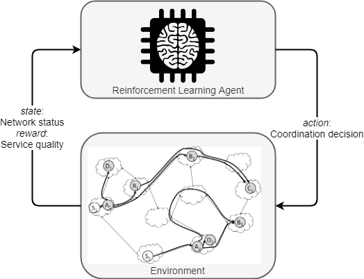

# A Software Campus project

RealVNF is a 2-year project (11/2018 to 10/2020) that is funded by the BMBF and part of the [Software Campus](https://www.softwarecampus.de/en/), which means that the entire project is managed and lead by a PhD student - here, [Stefan Schneider](https://stefanbschneider.github.io/) from Paderborn University, Germany.

The goal of the project is to design and develop concepts and algorithms to improve coordination of chained virtual network functions (VNFs) under realistic conditions to take cloud computing and network softwarization to the next level.

In collaboration with Huawei, we try to focus on practical applicability and usefulness, while combining it with new research ideas and approaches. A current focus is on combining classical networking with deep reinforcement learning approaches.

As the project evolves, this website will be updated continuously to point to published papers or open-source code. So stay tuned!

## Research

### Self-Learning, Continuous Network Coordination Through Deep Reinforcement Learning

Coordination of network services requires continuously updating the placement of service functions in the network as well as their chaining and the allocation of incoming network flows to these chained functions. So far, this challenges has been mostly tackled through carefully designed algorithms by researchers and networking experts. However, whenever an underlying assumption, e.g., about traffic or network characteristics, changes, these algorithms have to be adjusted. Adjusting an algorithm manually to consider previously unforeseen changes or aspects, requires human expertise and weeks or months to complete.

In contrast, we propose a model-free deep reinforcement learning approach, which learns network coordination without human interaction, simply by interaction with the network. Operators only have to specify one or multiple high-level objectives and their priority and the reinforcement learning agent learns how to achieve these objectives by itself - even if conditions change over time, e.g., with stochastic, non-stationary traffic arrival.

## Team

	
	

**Project lead:** Stefan Schneider, Paderborn University ([GitHub](https://github.com/stefanbschneider/), [LinkedIn](https://www.linkedin.com/in/stefanbschneider/), [Twitter](https://twitter.com/stefan_schn))

**Industrial partners:**

* Artur Hecker, Huawei Munich Research Center
* Ramin Khalili, Huawei Munich Research Center
* Xun Xiao, Huawei Munich Research Center

**Student researchers and developers:**

* Adnan Manzoor, Paderborn University ([GitHub](https://github.com/adnan904))
* Haydar Qarawlus, Paderborn University ([GitHub](https://github.com/qarawlus/), [LinkedIn](https://www.linkedin.com/in/qarawlus))

	
	

*Logo made with [DesignEvo](https://www.designevo.com/en/). Website built with Jekyll and the [Cayman theme](https://github.com/pages-themes/cayman).*
