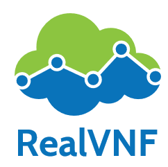

# A Software Campus project

RealVNF is a 2-year project (11/2018 to 01/2021) that is funded by the BMBF and part of the [Software Campus](https://www.softwarecampus.de/en/). The project is a collaboration between Paderborn University, Germany, and Huawei Munich.

The goal of the project is to design and develop concepts and algorithms to improve coordination of chained virtual network functions (VNFs) under realistic conditions to take cloud computing and network softwarization to the next level. A strong focus is on novel approaches leveraging machine learning and reinforcement learning.

## Project Outcomes

### Publications

* **Self-Driving Network and Service Coordination Using Deep Reinforcement Learning**
  S. Schneider, A. Manzoor, H. Qarawlus, R. Schellenberg, H. Karl, R. Khalili, and A. Hecker
  IEEE International Conference on Network and Service Management (CNSM), 2020 [[preprint](https://ris.uni-paderborn.de/record/19609)] [[code](https://github.com/RealVNF/deep-rl-network-service-coordination)]
* **Every Node for Itself: Fully Distributed Service Coordination**
  S. Schneider, L. D. Klenner, H. Karl
  IEEE International Conference on Network and Service Management (CNSM), 2020 [[preprint](https://ris.uni-paderborn.de/record/19607)] [[code](https://github.com/CN-UPB/distributed-coordination)]
* **Machine Learning for Dynamic Resource Allocation in Network Function Virtualization**
  S. Schneider, N. P. Satheeschandran, M. Peuster, and H. Karl
  IEEE Conference on Network Softwarization (NetSoft), 2020 [[preprint](https://ris.uni-paderborn.de/record/16219)] [[code](https://github.com/CN-UPB/ml-for-resource-allocation)]            

### Open-Source Repositories

* [deep-rl-network-service-coordination](https://github.com/RealVNF/deep-rl-network-service-coordination): A deep reinforcement learning framework for self-driving network & service coordination.
* [coord-sim](https://github.com/RealVNF/coord-sim): A Python lightweight flow-level simulator for evaluating network & service coordination algorithms.
* [distributed-coordination](https://github.com/CN-UPB/distributed-coordination): Fully distributed algorithms for highly scalable network & service coordination.
* [ml-for-resource-allocation](https://github.com/CN-UPB/ml-for-resource-allocation): Machine learning framework for dynamic resource allocation in NFV.

## Team

	
	

**Project lead:** 

* [Stefan Schneider](https://stefanbschneider.github.io), Paderborn University

**Industrial partners:**

* Artur Hecker, Huawei Munich Research Center
* Ramin Khalili, Huawei Munich Research Center

**Student researchers and developers:**

* Adnan Manzoor, Paderborn University
* Haydar Qarawlus, Paderborn University
* Rafael Schellenberg, Paderborn University

	
	

*Logo made with [DesignEvo](https://www.designevo.com/en/). Website built with Jekyll and the [Cayman theme](https://github.com/pages-themes/cayman).*
